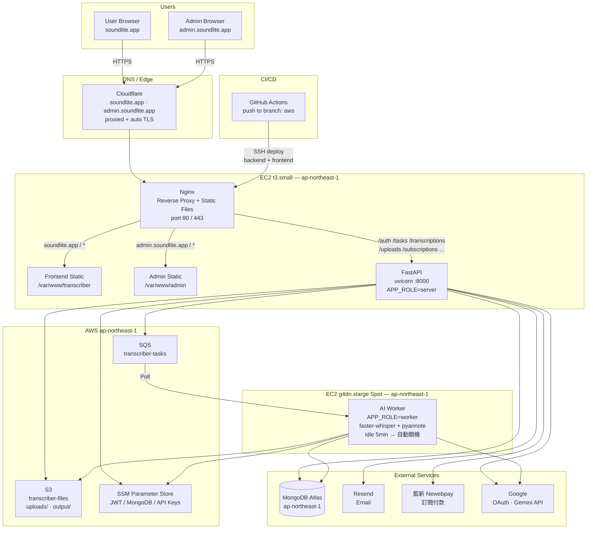
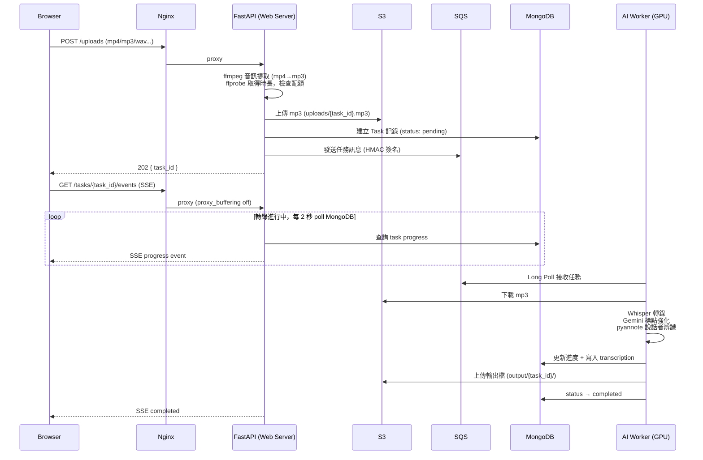

# Whisper Transcriber

> 企業級多語言語音轉錄系統，支援用戶認證、標籤管理、審計日誌與管理後台

## 專案簡介

Whisper Transcriber 是一個功能完整的多語言語音轉錄平台，基於 OpenAI Whisper 進行高精度語音辨識，支援中文、英文、日文、韓文等多種語言。系統整合 Google Gemini 和 OpenAI API 自動添加標點符號，採用前後端分離架構，提供完整的用戶認證、任務管理、標籤系統與管理後台。

## 主要功能

### 核心轉錄功能
- **語音轉文字**：使用 faster-whisper 進行高精度多語言語音辨識（支援 99+ 種語言）
- **智慧音檔切割**：自動偵測靜音點分段處理長音檔（>10分鐘）
- **標點符號服務**：整合 Google Gemini（預設）或 OpenAI API，支援多 API Key 輪詢
- **Speaker Diarization**：使用 pyannote.audio 自動識別多個說話者

### 用戶系統
- **用戶認證**：註冊 / 登入 / 登出，JWT Token 認證
- **Email 驗證**：註冊後 Email 驗證流程
- **密碼管理**：忘記密碼、重設密碼功能
- **Google OAuth**：支援 Google 第三方登入與帳戶綁定

### 任務管理
- **異步轉錄**：任務在背景執行，不阻塞其他請求
- **狀態追蹤**：即時查看任務進度（pending → processing → completed）
- **SSE 推送**：Server-Sent Events 即時狀態更新
- **任務取消**：支援取消進行中的轉錄任務
- **標籤系統**：建立、編輯、刪除標籤，為任務分類

### 管理後台
- **用戶管理**：查看所有用戶、修改狀態 / 角色 / 配額、重設密碼
- **任務管理**：查看、取消、刪除任務，批量操作
- **審計日誌**：記錄所有重要操作，支援篩選與統計
- **系統統計**：用戶數、任務數、使用量統計

## 技術架構

### 後端（Python / FastAPI）

```
src/
├── main.py                 # FastAPI Web Server 入口（APP_ROLE=server）
├── worker.py               # GPU Worker 入口（APP_ROLE=worker）
├── worker_core/            # Worker 拆出的元件
│   ├── sqs_consumer.py     # SQS Long Poll
│   ├── transcription_job.py# Worker 入口薄殼
│   ├── spot_monitor.py     # Spot 中斷偵測
│   ├── heartbeat.py        # 60 秒 keep-alive
│   └── model_cache.py / config.py / db.py / state.py
├── routers/                # API 路由層
│   ├── auth.py / oauth.py             # 認證 / Google OAuth
│   ├── tasks.py / transcriptions.py   # 任務 / 轉錄
│   ├── uploads.py / audio.py          # 批次上傳 / 音檔下載
│   ├── tags.py / summaries.py         # 標籤 / 摘要
│   ├── shared.py                      # 分享連結（無需登入）
│   ├── subscriptions.py               # 藍新訂閱 / webhook
│   └── admin.py                       # 管理後台（prefix=/api/admin）
├── services/               # 業務邏輯層
│   ├── task_service.py
│   ├── transcription_service.py       # 本地模式轉錄入口
│   ├── worker_dispatch.py             # S3 + HMAC + SQS 派發
│   ├── progress_store.py              # transient progress state
│   ├── tag_service.py / summary_service.py / audio_service.py
│   └── utils/
│       ├── whisper_processor.py       # Whisper 轉錄
│       ├── punctuation_processor.py   # 標點處理
│       ├── diarization_processor.py   # 說話者辨識
│       └── audio_validator.py         # 上傳白名單（副檔名 + magic bytes）
├── transcription/          # 轉錄 pipeline（Web Server 與 Worker 共用）
│   ├── orchestrator.py     # 單次 run 的 Phase 狀態機 + 取消 + 終態
│   └── audio_source.py     # AudioSource：LocalFileSource / S3Source
├── utils/                  # 跨層共用工具
│   ├── storage_service.py  # local / S3 切換
│   ├── config_loader.py    # SSM / .env
│   ├── newebpay_service.py # 藍新 AES 加解密
│   ├── audit_logger.py     # 操作審計
│   ├── email_service.py    # Resend / SMTP / console
│   └── logger.py           # structlog + RequestIdMiddleware
├── database/               # 資料存取層
│   ├── mongodb.py          # 連線（Motor）
│   ├── sync_client.py      # Worker 同步 client
│   └── repositories/       # CRUD per collection
└── auth/                   # JWT / 密碼 / 依賴注入
```

### 前端（Vue 3 / Vite）

```
frontend/                   # 用戶前端
├── src/
│   ├── views/              # 頁面組件
│   ├── components/         # 可複用組件
│   ├── composables/        # Vue 3 組合函數
│   ├── stores/             # Pinia 狀態管理
│   └── router/             # 路由配置
└── ...

admin-frontend/             # 管理後台
├── src/
│   ├── views/              # 管理頁面
│   └── ...
└── ...
```

### 技術棧

| 類別 | 技術 |
|------|------|
| 後端框架 | FastAPI + Uvicorn |
| 語音辨識 | faster-whisper + PyTorch |
| 說話者辨識 | pyannote.audio |
| 標點服務 | Google Gemini / OpenAI API |
| 資料庫 | MongoDB (Motor 異步驅動) |
| 認證 | JWT + bcrypt |
| 前端框架 | Vue 3 + Vite |
| 狀態管理 | Pinia |
| HTTP 客戶端 | Axios |
| 音頻播放 | WaveSurfer.js |
| 國際化 | Vue I18n |
| 容器化 | Docker + Docker Compose |

## AWS 部署架構

### 整體架構



### 音檔轉錄任務流程



### 本地開發 vs AWS 環境切換

| 服務 | 本地 (`DEPLOY_ENV=local`) | AWS (`DEPLOY_ENV=aws`) |
|------|--------------------------|------------------------|
| 音檔儲存 | 本機 `uploads/` | AWS S3 |
| 任務派發 | 直接呼叫 Service | SQS 訊息佇列 |
| Whisper 模型 | 同進程載入 | 僅 Worker 載入 |
| SSE 狀態 | in-memory dict | MongoDB polling |
| Email | Console 印出 | Resend |
| 密鑰 | `.env` 檔案 | SSM Parameter Store |

## 目錄結構

```
transcriber/
├── src/                      # 後端原始碼
├── frontend/                 # 用戶前端 (Vue 3)
├── admin-frontend/           # 管理後台 (Vue 3)
├── output/                   # 轉錄結果輸出
├── uploads/                  # 上傳文件存儲
├── requirements.txt          # Python 依賴（共用）
├── requirements-web.txt      # Web Server 額外依賴
├── requirements-worker.txt   # GPU Worker 額外依賴
├── requirements-dev.txt      # 開發 / 測試依賴（pytest, ruff）
├── .env.example              # 環境變數範本
├── Dockerfile                # 後端 Docker 配置
├── docker-compose.yml        # 多容器編排
├── start_backend_daemon.sh   # 啟動後端腳本
├── stop_backend.sh           # 停止後端腳本
├── restart_backend.sh        # 重啟後端腳本
└── status_backend.sh         # 查看後端狀態
```

## 快速開始

### 系統需求

- Python 3.10+
- Node.js 16+
- MongoDB 7.0+
- FFmpeg（音頻編解碼）
- 8-12GB RAM（使用 medium 模型）

### 1. 環境設定

```bash
# 克隆專案
git clone <repository-url>
cd transcriber

# 設定環境變數
cp .env.example .env
# 編輯 .env 填入您的配置
```

### 2. 環境變數配置

完整變數列表與註解見 [`.env.example`](./.env.example)，最關鍵幾項：

| 變數 | 用途 |
|------|------|
| `MONGODB_URL` | MongoDB 連線字串（**必須含 `?replicaSet=rs0&directConnection=true` 才能用 transaction**） |
| `JWT_SECRET_KEY` | 32+ 字元高熵密鑰，啟動時會驗證 entropy（`openssl rand -hex 32`） |
| `GOOGLE_API_KEY_1` ~ `_N` | Gemini 標點 API（多 key 輪詢） |
| `HF_TOKEN` | Speaker Diarization 必填 |
| `GOOGLE_CLIENT_ID` | Google OAuth |
| `EMAIL_PROVIDER` | `console` / `smtp` / `resend`（生產用 Resend） |
| `NEWEBPAY_MERCHANT_ID` / `_HASH_KEY` / `_HASH_IV` / `_ENV` | 藍新金流訂閱付款 |
| `DEPLOY_ENV` | `local`（同進程 Whisper）或 `aws`（Web + GPU Worker 分離） |
| `APP_ROLE` | `server` 或 `worker`（僅 AWS 模式需要）|

### 3. 啟動服務

#### 方式一：使用 Docker Compose（推薦）

```bash
# 啟動所有服務
docker-compose up -d

# 服務端口：
# - 前端：http://localhost:3000
# - 管理後台：http://localhost:3003
# - 後端 API：http://localhost:8000
# - MongoDB：localhost:27020
```

#### 方式二：原生運行

**啟動 MongoDB：**
```bash
# 使用 Docker 運行 MongoDB
docker run -d --name mongo -p 27020:27017 mongo:7.0
```

**啟動後端：**
```bash
# 安裝依賴
pip install -r requirements.txt

# 背景執行（推薦）
./start_backend_daemon.sh

# 或前景執行（開發用）
python src/main.py --host 0.0.0.0 --port 8000 --model medium
```

**啟動前端：**
```bash
# 用戶前端
cd frontend
npm install
npm run dev  # http://localhost:5173

# 管理後台
cd admin-frontend
npm install
npm run dev  # http://localhost:5174
```

### 4. 後端管理腳本

```bash
./start_backend_daemon.sh   # 啟動後端（背景執行）
./status_backend.sh         # 查看後端狀態
./stop_backend.sh           # 停止後端
./restart_backend.sh        # 重啟後端
tail -f backend.log         # 查看即時日誌
```

## API 端點

### 認證相關

| 方法 | 端點 | 描述 |
|------|------|------|
| POST | `/auth/register` | 用戶註冊 |
| POST | `/auth/login` | 用戶登入 |
| POST | `/auth/logout` | 用戶登出 |
| POST | `/auth/refresh` | 刷新 Token |
| GET | `/auth/me` | 獲取當前用戶資訊 |
| GET | `/auth/verify-email` | Email 驗證 |
| POST | `/auth/forgot-password` | 忘記密碼 |
| POST | `/auth/reset-password` | 重設密碼 |

### OAuth 相關

| 方法 | 端點 | 描述 |
|------|------|------|
| POST | `/oauth/google` | Google OAuth 登入 |
| POST | `/oauth/google/bind` | 綁定 Google 帳戶 |
| DELETE | `/oauth/google/unbind` | 解綁 Google 帳戶 |

### 任務與轉錄

| 方法 | 端點 | 描述 |
|------|------|------|
| GET | `/tasks` | 列出當前用戶任務（支援篩選） |
| GET | `/tasks/recent` | 最近任務 |
| GET | `/tasks/{task_id}` | 獲取任務狀態 |
| GET | `/tasks/{task_id}/events` | SSE 即時進度推送 |
| POST | `/tasks/{task_id}/cancel` | 取消任務 |
| DELETE | `/tasks/{task_id}` | 刪除任務 |
| PUT | `/tasks/{task_id}/tags` | 更新任務標籤 |
| PUT | `/tasks/{task_id}/keep-audio` | 切換是否保留音檔 |
| POST | `/tasks/batch/delete` | 批次刪除 |
| POST | `/tasks/batch/tags/add` | 批次加標籤 |
| POST | `/transcriptions` | 建立轉錄任務 |
| POST | `/transcriptions/batch` | 批次建立轉錄 |
| GET | `/transcriptions/{task_id}/download` | 下載轉錄結果 |
| GET | `/transcriptions/{task_id}/audio` | 下載原始音檔 |
| GET | `/transcriptions/{task_id}/segments` | 獲取時間軸片段 |
| PUT | `/transcriptions/{task_id}/content` | 更新轉錄文字 |
| PUT | `/transcriptions/{task_id}/metadata` | 更新檔名等中繼資料 |
| PUT | `/transcriptions/{task_id}/speaker-names` | 編輯說話者名稱 |
| PUT | `/transcriptions/{task_id}/subtitle-settings` | 字幕顯示設定 |

### 標籤管理

| 方法 | 端點 | 描述 |
|------|------|------|
| POST | `/tags` | 建立標籤 |
| GET | `/tags` | 獲取所有標籤 |
| GET | `/tags/order` | 取得標籤順序 |
| PUT | `/tags/order` | 更新標籤順序 |
| PUT | `/tags/{tag_id}` | 更新標籤 |
| DELETE | `/tags/{tag_id}` | 刪除標籤 |
| GET | `/tags/statistics` | 獲取標籤統計 |

### 管理後台

| 方法 | 端點 | 描述 |
|------|------|------|
| GET | `/api/admin/users` | 列出所有用戶 |
| GET | `/api/admin/users/{user_id}` | 用戶詳情 |
| PUT | `/api/admin/users/{user_id}/status` | 修改用戶狀態 |
| PUT | `/api/admin/users/{user_id}/role` | 修改用戶角色 |
| PUT | `/api/admin/users/{user_id}/quota` | 修改配額 |
| POST | `/api/admin/users/{user_id}/reset-quota` | 重置配額 |
| POST | `/api/admin/users/{user_id}/extra-quota` | 加贈配額 |
| POST | `/api/admin/users/{user_id}/reset-password` | 重設密碼 |
| GET | `/api/admin/tasks` | 列出所有任務 |
| GET | `/api/admin/tasks/{task_id}` | 任務詳情 |
| POST | `/api/admin/tasks/{task_id}/cancel` | 管理員取消任務 |
| DELETE | `/api/admin/tasks/{task_id}` | 管理員刪除任務 |
| GET | `/api/admin/statistics` | 系統統計 |
| GET | `/api/admin/audit-logs` | 操作審計日誌 |
| GET | `/api/admin/audit-logs/failed` | 失敗操作日誌 |
| GET | `/api/admin/audit-logs/statistics` | 操作統計 |

完整 API 文檔請訪問：
- **Swagger UI**: `http://localhost:8000/docs`
- **ReDoc**: `http://localhost:8000/redoc`

## 使用流程

### 1. 用戶註冊與登入

1. 訪問前端 `http://localhost:3000`
2. 點擊「註冊」建立帳戶
3. 檢查 Email 並點擊驗證連結
4. 使用帳號密碼登入，或使用 Google 第三方登入

### 2. 上傳音檔轉錄

1. 在主頁面上傳音檔（支援 m4a, mp3, wav, mp4, flac 等）
2. 選擇標點服務（Gemini / OpenAI / 無）
3. 選擇是否啟用說話者辨識
4. 提交後可即時查看轉錄進度
5. 完成後可下載結果或在線編輯

### 3. 管理轉錄結果

- 在「我的任務」頁面查看所有任務
- 使用標籤功能分類管理
- 點擊任務查看詳細內容與時間軸
- 支援下載 txt 格式

## 常見問題

### Q: 支援哪些音訊格式？
A: 支援所有 FFmpeg 可處理的格式，包括 m4a, mp3, wav, mp4, flac 等。

### Q: 支援哪些語言？
A: 支援 Whisper 模型支援的所有語言（99+ 種），包括中文、英文、日文、韓文、法文、德文、西班牙文等。系統會自動偵測語言，也可手動指定。

### Q: 哪個 Whisper 模型最好？
A: `medium` 模型提供良好的準確度與速度平衡。若需最高準確度選 `large-v2`，若需快速處理選 `small`。對於非英語語言，建議使用 `medium` 以上的模型。

### Q: 標點符號服務選哪個？
A: Google Gemini 速度較快且成本較低，OpenAI GPT 品質稍好但較貴。兩者都能提供良好結果。

### Q: 如何處理長音檔？
A: 系統會自動偵測靜音點並分段處理，預設超過 10 分鐘的音檔會自動切割。

### Q: 可以同時轉錄多個檔案嗎？
A: 支援。目前並發數限制為 2，超過的請求會自動排隊。

### Q: Speaker Diarization 需要什麼？
A: 需要 Hugging Face Token，並同意 pyannote 模型的使用條款。

### Q: 忘記密碼怎麼辦？
A: 在登入頁面點擊「忘記密碼」，輸入 Email 後系統會發送重設連結。

## 相關文件

- 上線前狀態追蹤：[`docs/LAUNCH_READINESS_PLAN.md`](./docs/LAUNCH_READINESS_PLAN.md)
- 改善任務表（架構技術債）：[`docs/IMPROVEMENT_TASKS.md`](./docs/IMPROVEMENT_TASKS.md)
- 部署 SOP：[`docs/DEPLOYMENT.md`](./docs/DEPLOYMENT.md)
- 線上監控設定：[`docs/MONITORING_SETUP.md`](./docs/MONITORING_SETUP.md)
- Staging 規劃：[`docs/STAGING_PLAN.md`](./docs/STAGING_PLAN.md)
- 領域語言參考：[`CONTEXT.md`](./CONTEXT.md)
- 變更歷史：見 `git log`
