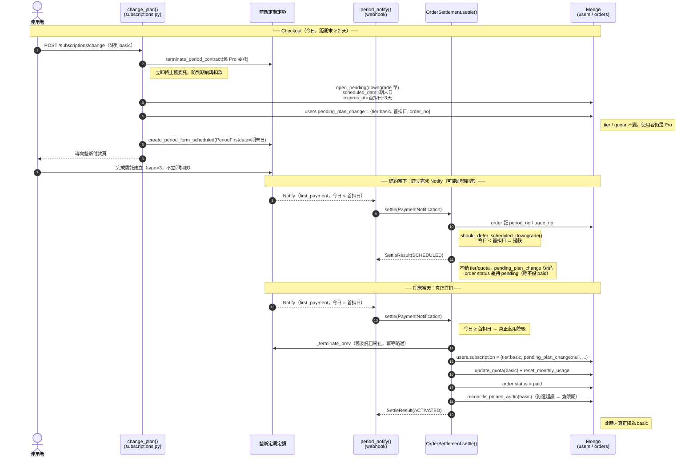
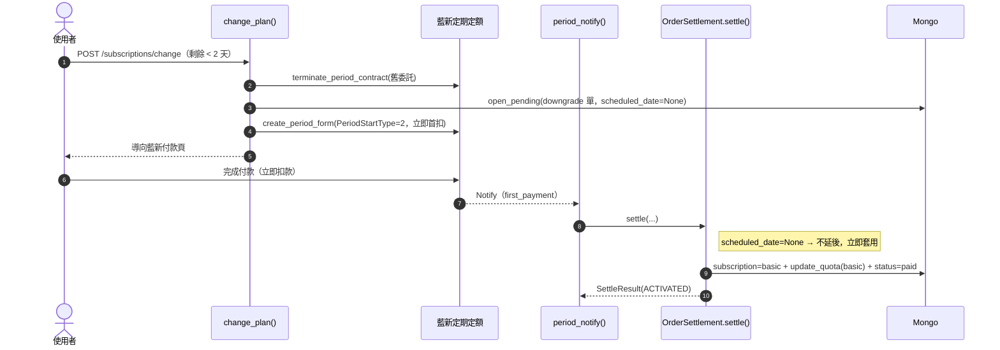

# 訂閱降級流程（排程降級 / 期末生效）

> 對應程式：`src/routers/subscriptions.py`（checkout）、`src/services/order_settlement.py`
> （webhook 結算）、`src/database/repositories/order_repo.py`（pending 單清掃）。
> 藍新定期定額欄位定義見 [`NEWEBPAY_PERIOD_API.md`](./NEWEBPAY_PERIOD_API.md)。

## 設計原則

使用者降級應**維持舊方案到目前計費週期結束，期末才切到新的低方案**（不立即生效）。
實作方式：checkout 端立即終止舊委託、建立一張**首扣日 = 期末**的新定期定額委託
（藍新 `PeriodType=D + PeriodStartType=3`），並在 user 上記 `pending_plan_change`；
**tier / quota 到期末真正首扣才變更**。

判別「是否已到期末」以 **首扣日（`scheduled_date`，台灣時區）vs 今日** 為準，
**不依賴藍新 Notify 的欄位格式**（`AuthTimes` / `AlreadyTimes`）——因為藍新 NPA-N050
（帶 `AlreadyTimes`）依手冊是「第二期含之後」才發，期末真正首扣（第 1 期）可能是無
`AlreadyTimes` 的建立完成格式，用欄位判別會誤擋。

---

## 情境 A：排程降級（目前週期剩餘 ≥ 2 天）— 期末生效

**關鍵不變式**

| 步驟 | 保證 |
|------|------|
| Checkout | 只記 `pending_plan_change`，**tier / quota 不變** |
| 建約 Notify（首扣日之前） | 回 `SCHEDULED`，status **維持 pending**（設 paid 會讓期末首扣被 `already_paid` 短路） |
| pending 單存活 | `expires_at = 首扣日 + 3 天`，不被 `periodic_order_cleanup` 提早掃成 expired |
| 期末首扣 Notify | 今日 ≥ 首扣日 → 真正套用，與 Notify 欄位格式無關 |

---

## 情境 B：立即降級（目前週期剩餘 < 2 天）— 即時生效

剩餘不足 2 天不值得排程，直接用 `PeriodStartType=2` 立即建約首扣，`scheduled_date=None`。

---

## SettleOutcome 對照

| Outcome | 情境 |
|---------|------|
| `SCHEDULED` | 排程降級的 Notify 在首扣日之前到達 → 延後，尚未生效 |
| `ACTIVATED` | 首期成功、真正套用方案（含期末首扣 / 立即降級 / 新訂閱 / 升級） |
| `RENEWED` | 續扣成功、展期 |
| `EXPIRED` | 續扣失敗 → 降為 free |
| `ALREADY_PAID` | order 已 paid，重發短路 |

---

## ⚠️ 尚待 sandbox 驗證的殘留風險：webhook natural_id 碰撞

webhook 冪等鍵 `natural_id = f"{order}:{already_times if not None else 'init'}"`。
建立完成類 Notify（無 `AlreadyTimes`）一律編為 `{order}:init`。

若藍新對 `PeriodStartType=3` 在**建約當下**與**期末首扣**都送建立完成格式，兩封
`natural_id` 會**碰撞**，期末那封被 `ProcessedWebhookRepository.claim` 當重複擋掉、
進不了 `settle()` → 降級不生效。此取決於藍新 type-3 期末首扣的實際 Notify 型態
（手冊未明確）。

**部署前務必用 cloudflared sandbox 跑一次完整排程降級**，撈 `subscription.webhook.received`
的 log 確認：(a) 建約當下有無 Notify、(b) 期末首扣的 `AlreadyTimes` 有無、`natural_id`
是否碰撞。若碰撞，需再補 webhook 層修法（例如 init 類 natural_id 併入 `trade_no`）。
